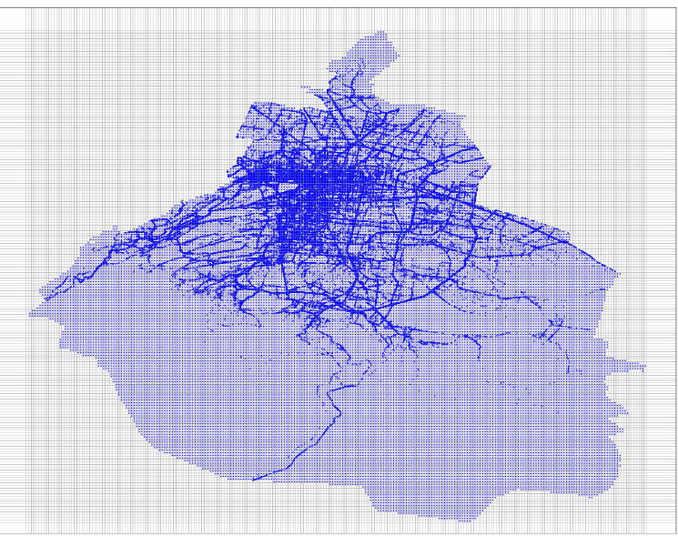
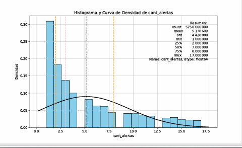
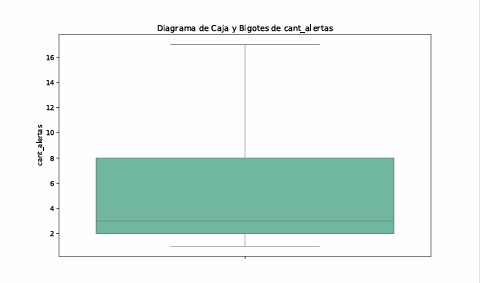
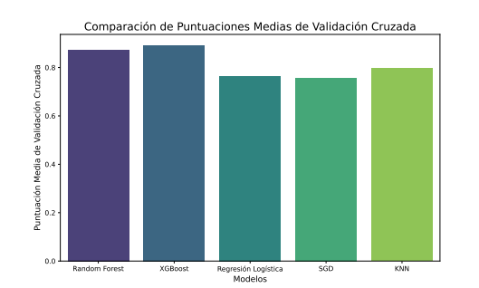

# Descripción

Traffic Risk Training es el proyecto encargado del análisis, transformación y entrenamiento del modelo de Machine Learning utilizado por Traffic Risk API.

El objetivo es generar un modelo capaz de clasificar el nivel de congestión vehicular utilizando datos históricos obtenidos de Waze en la Ciudad de México.

Durante el proceso se realiza la limpieza de datos, transformación espacial, análisis exploratorio, generación de nuevas características, entrenamiento de diferentes algoritmos de clasificación y selección automática del modelo con mejor desempeño.

# Problema que resuelve

Los datos obtenidos desde Waze contienen únicamente ubicaciones donde existió algún tipo de incidente.

Esto provoca un sesgo importante durante el entrenamiento, ya que el modelo únicamente aprendería zonas donde existen alertas.

Para reducir este problema se implementó un proceso que genera puntos adicionales en zonas sin registros, clasificándolos como Nivel Nulo, permitiendo que el modelo también aprenda regiones donde normalmente no existen incidentes.

# Arquitectura
```text
Datos Waze
      │
      ▼
Limpieza de datos
      │
      ▼
Transformación geográfica
      │
      ▼
Generación de puntos sin alertas
      │
      ▼
Análisis exploratorio (EDA)
      │
      ▼
Clasificación de niveles de alerta
      │
      ▼
Entrenamiento de modelos
      │
      ▼
Evaluación
      │
      ▼
Exportación del modelo
```

# Tecnologías utilizadas
Python
Pandas
NumPy
Scikit-Learn
XGBoost
Shapely
OSMnx
Matplotlib
Joblib
multiprocessing

# Flujo del entrenamiento
1. Limpieza de datos
    Eliminación de registros duplicados.
    Eliminación de valores nulos.
    Eliminación de columnas innecesarias.

2. Transformación
    Obtención del polígono oficial de la Ciudad de México mediante OSMnx.
    Construcción de una cuadrícula sobre la ciudad.
    Generación de puntos adicionales en zonas sin alertas.
    Filtrado de puntos pertenecientes únicamente a la CDMX.

3. Análisis exploratorio

    Se generan automáticamente:

    Scatter Plot
    Histogramas
    BoxPlot
    Eliminación de valores atípicos mediante IQR

    Toda la información se almacena en un reporte PDF.

4. Clasificación de alertas

    Cada cuadrícula obtiene un nivel de riesgo basado en la cantidad de alertas presentes.

    Las categorías utilizadas son:

    Alto
    Moderado Alto
    Moderado Bajo
    Bajo
    Nulo

5. Entrenamiento

    Se entrenan automáticamente los siguientes modelos:

    Random Forest
    XGBoost
    Logistic Regression
    SGD Classifier
    K-Nearest Neighbors

    Todos son evaluados mediante Validación Cruzada de 10 folds.

6. Evaluación

    Se comparan las puntuaciones promedio obtenidas por cada algoritmo.

    El modelo con mayor Accuracy es seleccionado automáticamente como modelo final.

7. Exportación

    Se generan automáticamente los siguientes archivos:

    artifacts/

        modelo_final.pkl

        label_encoder.pkl

        MetadataBuilder.json

# Resultados

### MAP

<p align="center">
    
</p>

### DATOS LIMPIOS

<p align="center">
    
</p>

<p align="center">
    
</p>

### COMPARACIÓN DE MODELOS

<p align="center">
    
</p>

Además del modelo entrenado se generan dos reportes:

```text
assets/
├── visualizacion_evaluacion_modelos_2019.pdf
└── 2019_model_evaluation.pdf
```

Estos contienen el análisis exploratorio y la comparación entre modelos.

# Estructura 
```text
traffic-risk-training/
│
├── .env
├── main.py
├── requirements.txt
|__ README.md
│
├── artifacts/
│   ├── label_encoder.pkl
│   ├── MetadataBuilder.json
│   └── modelo_final.pkl
│
├── assets/
│   ├── 2019_model_evaluation.pdf
│   └── visualizacion_evaluacion_modelos_2019.pdf
│
├── cleaning/
│   └── data_clean.py
│
├── database/
│   ├── datos_finales_2019.csv
│   └── df_juntos.csv
│
├── evaluation/
│   └── model_evaluation.py
│
├── export_model/
│   └── save_model.py
│
├── graphics/
│   └── graphics.py
│
├── training_model/
│   └── training.py
│
└── transformation/
    ├── alert_level.py
    ├── alert_modifier.py
    ├── pdf_pages.py
    ├── perimeter_cdmx.py
    └── transformer.py
```

# Instalación
git clone https://github.com/yayojair/traffic-risk-training.git

Crear entorno virtual

    python -m venv .venv

Activar entorno virtual

Instalar dependencias

    pip install -r requirements.txt

Configuración

Crear un archivo .env con las rutas correspondientes:

    DATA_PATH = database/df_juntos.csv
    CLEAN_DATA_PATH = database/clean_data.csv
    CLEAN_DATA_NAME = database/datos_finales_2019.csv
    DATA_VISUALIZATION_PDF = assets/Visualizar_alerta_2019_.pdf
    RUN_DATA_CLEANING = False

# Posibles mejoras
    * Comparar diferentes métricas de evaluación (F1 Score, Precision y Recall).
    * Optimización de hiperparámetros.
    * Validación sobre datos de diferentes años.
    * Automatización del pipeline mediante CI/CD.
    * Integración con MLflow para versionado de modelos.
    * Experimentación con técnicas para tratar el desbalance de clases.

## Dataset

    El dataset original no se incluye en este repositorio debido a su tamaño (≈1.5 GB).

    Durante el entrenamiento se utilizó un conjunto de datos obtenido de Waze correspondiente al año 2019 para la Ciudad de México.

    El archivo procesado generado por el pipeline sí puede encontrarse en:

    database/datos_finales_2019.csv

# Autor
    Edgar Jair Martínez Ruiz
